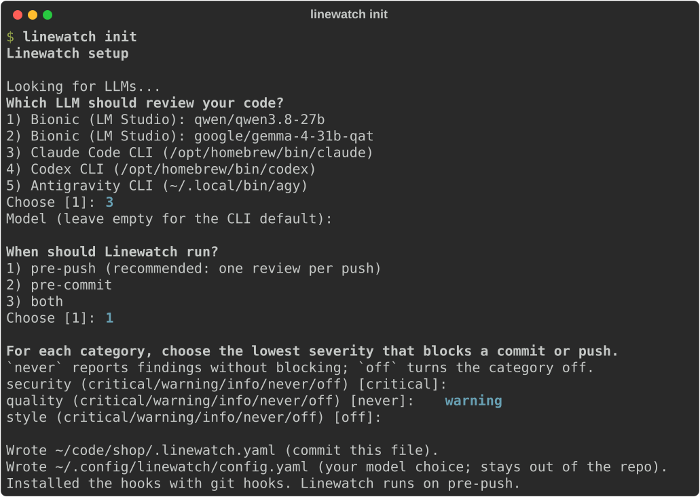
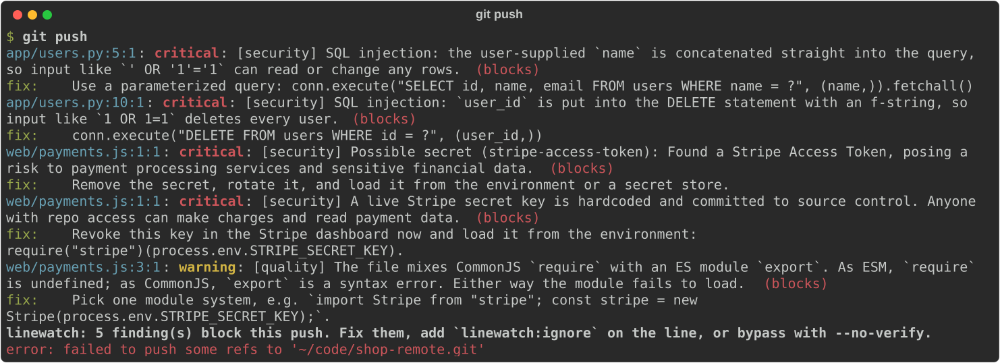

# Getting started

## Install

Linewatch needs Python 3.10 or later and git. Install [gitleaks](https://github.com/gitleaks/gitleaks) too, so secrets are caught before anything is sent to a model:

```
brew install gitleaks          # or see the gitleaks README for other systems
pipx install linewatch-cli
```

The PyPI package is called `linewatch-cli`; the command it installs is `linewatch`.

> Until 0.1.0 is released, PyPI only has a placeholder. Install from a clone instead: `pipx install ./linewatch`.

You also need a model. See [Models](models.md) for the options; any coding CLI you already use, such as Claude Code or Codex, works without extra setup.

## Set up a repo

Run the wizard in your repo:

```
cd your-repo
linewatch init
```



The wizard:

1. Looks for the models on your machine and asks which one to use. If it finds one, it asks you to confirm it. If it finds none, it offers to take an API key, explains how to install a local model, or sets up gitleaks only until you add a model.
2. Asks when to run: on push (recommended, since a review can take a while), on commit, or both.
3. Asks, for each category, the lowest severity that blocks. By default only critical security findings block.
4. Writes `.linewatch.yaml` with the team rules, and your model choice to `~/.config/linewatch/config.yaml`.
5. Installs the hooks: native git hooks, or Husky or the pre-commit framework if the repo already uses one.

Commit `.linewatch.yaml`, so the rest of the team gets the same rules.

## Join a repo that already uses Linewatch

```
linewatch init --yes
```

This takes the team rules from `.linewatch.yaml` and installs the hooks without questions. Your model comes from your user config, or from the only model on your machine. If several or none are found, Linewatch runs gitleaks only until you pick one with `linewatch model`.

## What happens on a push

With the pre-push hook, Linewatch reviews the commits you are pushing:

1. Skips lockfiles, generated and minified code, binaries and files matching `exclude`.
2. Runs gitleaks on the changes.
3. Sends the changes to your model, in chunks, and asks for findings in a fixed JSON format.
4. Keeps only findings on the lines you changed, and drops the ones marked `linewatch:ignore`.
5. Prints the findings, writes them to `.linewatch/last.sarif` for the editor, and stops the push if one reaches its category's blocking level.



Each finding is printed as `file:line:col: severity: message`, which IDE problem panels and terminals can link to.

If the model times out, can't be reached or gives an answer Linewatch can't read, Linewatch prints one line and lets the push through. gitleaks findings still count, so a leaked secret is blocked even then.

## Review by hand

```
linewatch review                 # the uncommitted changes
linewatch review --range main    # the commits from main to HEAD
```

## When a finding blocks

- **Fix the code** and commit or push again.
- **Silence one finding** with a `linewatch:ignore` comment on its line:

  ```python
  API_URL = "http://localhost:8000"  # linewatch:ignore
  ```

- **Bypass once** with `git commit --no-verify` or `git push --no-verify`.

## Switch the model

```
linewatch model
```

Shows the models found again and saves your new choice. The team rules don't change.
