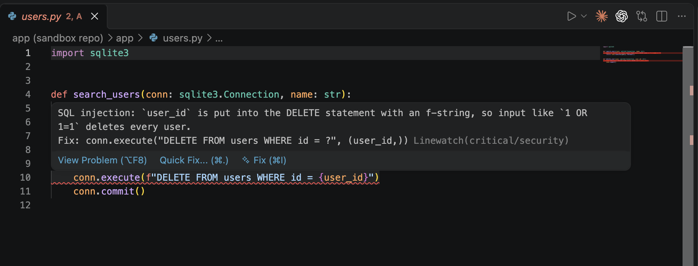
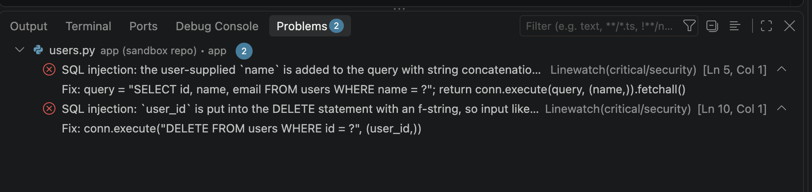
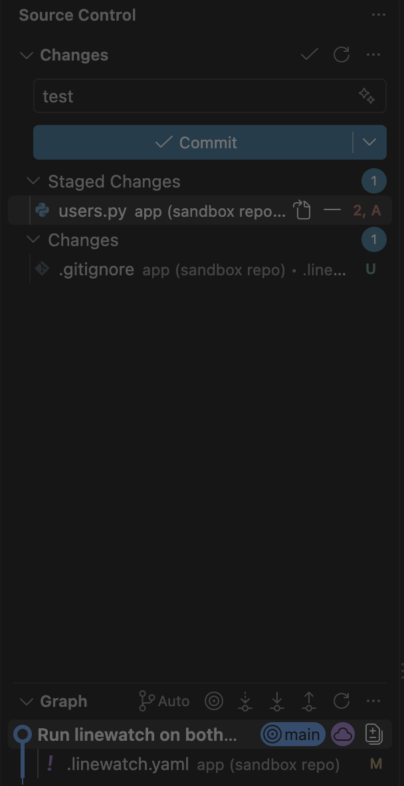

# VS Code extension

The Linewatch extension shows the findings of the last review on the lines in your editor, like linter warnings. It reads `.linewatch/last.sarif`, which Linewatch writes after every review, from a hook or `linewatch review`.

## Install

Install **Linewatch** from the VS Code Marketplace. It starts in any workspace folder that has `.linewatch.yaml` or `.linewatch/last.sarif`.

> Until 0.1.0 is released, the Marketplace only has a placeholder. To try the extension from a clone, open `vscode/` in VS Code and press F5.

## Findings on the lines

| Severity | Shown as |
|---|---|
| critical | error (red) |
| warning | warning (yellow) |
| info | hint |

Hover a marker to see the message and the suggested fix. The markers update as soon as a new review finishes; a review with no findings clears them. A half-written or broken SARIF file is ignored, so the markers never flicker away during a review.

## Problems panel

All findings are also listed in the Problems panel (`View > Problems`), with their file and line.

## Commits from the Source Control view

The hooks run for commits and pushes from the Source Control view too. When a finding blocks, VS Code shows the git error, and the markers appear on the lines at the same time. Use **Show Command Output** to see the full list.

## Commands

| Command | What it does |
|---|---|
| `Linewatch: Show Status` | Shows how many findings the last review left |
| `Linewatch: Reload Findings` | Reads the SARIF file again |

## Other editors

`.linewatch/last.sarif` is standard SARIF, so other tools can show it too, for example the SARIF Viewer extension or JetBrains IDEs.
